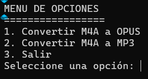

# SISTEMA DE CONVERSIÓN DE AUDIOS (SCAS)



## 1. Descripción del proyecto
SCAS es un programa que convierte archivos en formato m4a en otros (opus y mp3 actualmente) como también los comprime. De esta manera, beneficia la portabilidad del audio y carga en páginas web.

## 2. Estado del proyecto


## 3. Tecnologías utilizadas


## 4. Guía de instalación
1) Descargar el motor de conversión ([FFMPEG](https://www.gyan.dev/ffmpeg/builds/)).
    - ffmpeg-release-essentials.7z o
    - ffmpeg-release-essentials.zip

2) Agregar la dirección de la subcarpeta bin al PATH del sistema (renombrar la carpeta principal si es necesario).

3) Copiar el archivo ```SCAS.exe``` en la ubicación de su preferencia.

4) Ejecutar el archivo (doble click o enter)

## 5. Licencia
[](./LICENSE)